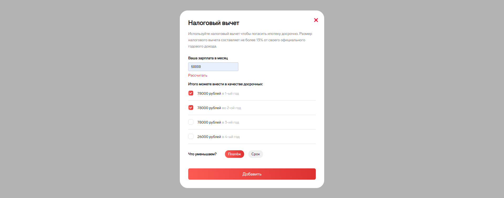
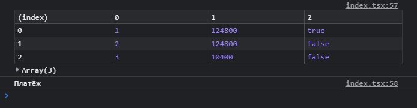

# Расчёт налогового вычета

Реализация расчёта налогового вычета осуществлена через формулу: `(x * 12) * 0.13`

## Главная страница
Страница с кнопкой, после нажатия на *Налоговый вычет* выводится форма с полем ввода данных для дальнейшего расчёта.

## Форма ввода
##### Первая фаза
Изначально перед пользователем представлена форма с заблокированной кнопкой. Кнопка будет доступна после ввода и расчёта данных. При вводе невалидных данных (всё кроме цифр) будет происходить вывод ошибки, кнопка блокируется. Если после расчёта данных в поле ввода будет изменение указанной зарплаты, то область с чекбоксами будет скрыта и нажатие на кнопку будет недоступно. Также работает выбор типа расчёта: платёж или срок.

##### Вторая фаза

После ввода данных появляется область с чекбоксами, кнопка становится доступной для клика.

## Результат

После нажатия на кнопку *Добавить* в консоли появляется таблица со следующими столбцами:
- Индекс;
- Год;
- Сумма денег;
- Булевое значение чекбокса;

## Скрипты

Команда запуска проекта:

### `yarn start`